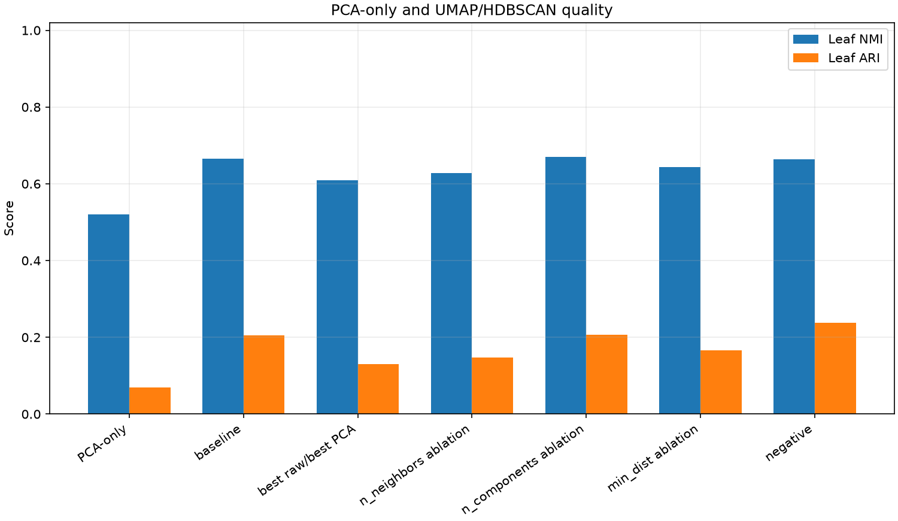
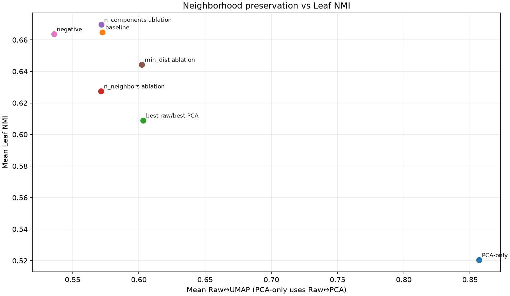
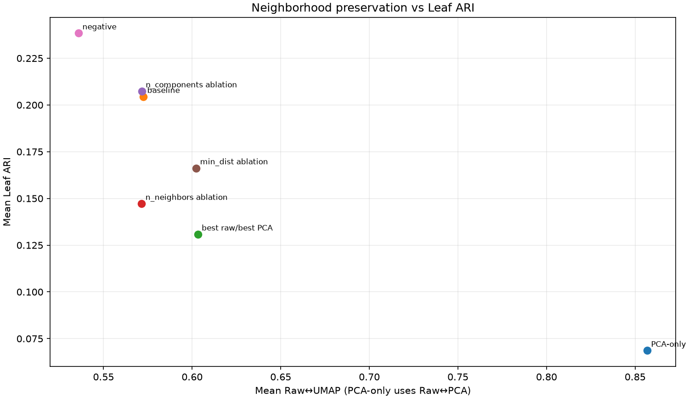
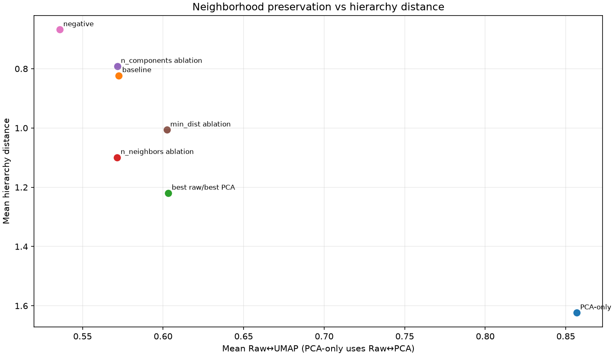
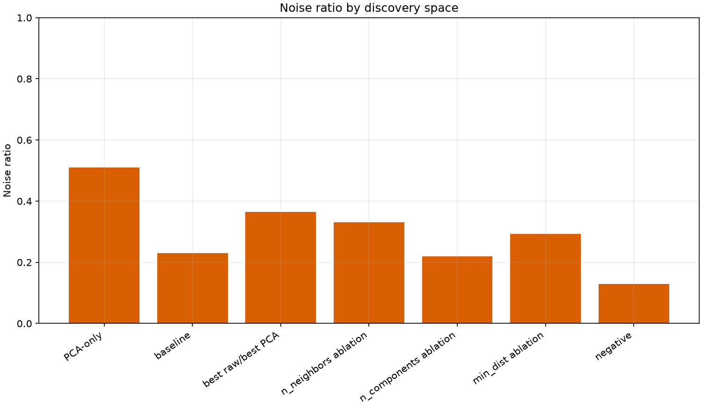
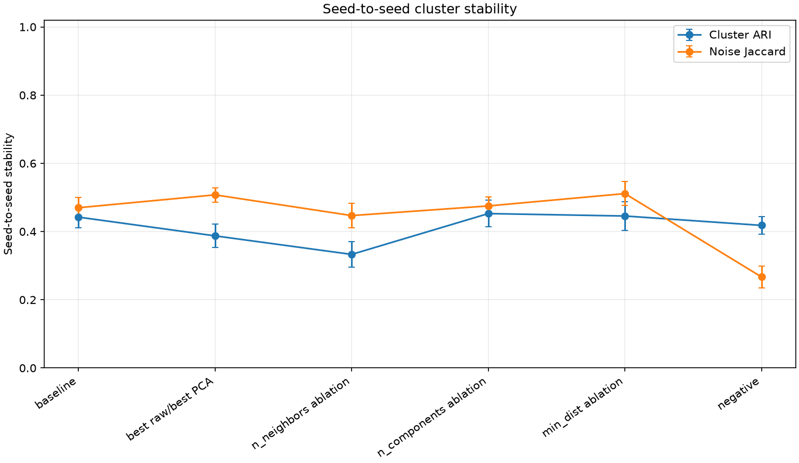

# PCA·UMAP·HDBSCAN follow-up benchmark

This report evaluates HDBSCAN after the fixed PCA/UMAP neighborhood experiment. HDBSCAN parameters are fixed; the PCA-only row is the no-UMAP control.

## Dataset and protocol

- Input: `dbpedia_gemini_embeddings.json.gz`; Gemini model = `gemini-embedding-001`, task = `CLUSTERING`, dimensionality = 3072.
- Rows: 720 sampled with seed 42; fingerprints are stored in `dataset-fingerprint.json`.
- Fixed PCA: 160D, seed 42, selection reason `global_preservation_knee_after_local_plateau`.
- HDBSCAN input uses the normalized selected PCA prefix from phase 1 so this follow-up is directly aligned with the neighborhood-preservation experiment; the repository production comparison path currently keeps an unnormalized PCA prefix for its auxiliary membership calculation.
- UMAP seeds: [42, 43, 44, 45, 46]; metric = Euclidean, init = random, n_jobs = 1.
- HDBSCAN: min_cluster_size = 5, min_samples = 3, metric = Euclidean, cluster_selection_method = leaf.
- Evaluated metrics: Leaf/parent/top NMI and ARI, DBpedia ground-truth hierarchy distance, noise ratio, cluster count, silhouette, and seed-to-seed cluster stability.

## Data scope note

The committed run uses the repository's Gemini DBpedia dataset, not the unavailable Wikipedia BGE artifact. These results are valid for this Gemini dataset and should not be relabeled as the Wikipedia benchmark.
Hierarchy distance is measured against the DBpedia class hierarchy in metadata; it is not a claim that HDBSCAN's unsupervised density tree is a semantic taxonomy.

## Configuration results

| condition | roles | UMAP | mean Raw↔UMAP | mean PCA↔UMAP | Leaf NMI | Leaf ARI | hierarchy distance | noise ratio | clusters | seed cluster ARI |
|---|---|---:|---:|---:|---:|---:|---:|---:|---:|---:|
| pca_only | pca_only_control | PCA-only | — | — | 0.5204 | 0.0686 | 1.6236 | 0.5097 | 34.00 | — |
| umap | production_baseline | 15 / 20 / 0.1 | 0.5725 | 0.5905 | 0.6649 | 0.2044 | 0.8231 | 0.2306 | 53.40 | 0.4423 |
| umap | best_raw_preservation, best_pca_preservation | 100 / 20 / 0.5 | 0.6033 | 0.6219 | 0.6089 | 0.1308 | 1.2197 | 0.3644 | 39.60 | 0.3874 |
| umap | n_neighbors_ablation | 100 / 20 / 0.1 | 0.5715 | 0.5869 | 0.6275 | 0.1472 | 1.0992 | 0.3308 | 43.80 | 0.3330 |
| umap | n_components_ablation | 15 / 5 / 0.1 | 0.5716 | 0.5899 | 0.6697 | 0.2074 | 0.7917 | 0.2197 | 54.20 | 0.4526 |
| umap | min_dist_ablation | 15 / 20 / 0.5 | 0.6023 | 0.6218 | 0.6443 | 0.1662 | 1.0064 | 0.2936 | 44.40 | 0.4456 |
| umap | negative_control | 5 / 50 / 0.0 | 0.5359 | 0.5516 | 0.6637 | 0.2384 | 0.6681 | 0.1289 | 66.40 | 0.4181 |

## Interpretation

- PCA-only vs production baseline: Leaf NMI 0.5204 vs 0.6649; Leaf ARI 0.0686 vs 0.2044.
- Production baseline at k=15: Raw↔UMAP 0.5839, PCA↔UMAP 0.6087, seed cluster ARI 0.4423.
- The configuration selected for highest phase-1 Raw↔UMAP preservation is 100 / 20 / 0.5; its Leaf NMI is 0.6089 and Leaf ARI is 0.1308.
- A production change should require joint evidence from neighborhood preservation, Leaf NMI/ARI, hierarchy distance, noise behavior, and seed stability. This benchmark does not change production settings automatically.

## Artifacts

- `report.json`: complete run-level and aggregate report.
- `runs.csv`: one row per PCA-only or UMAP seed run.
- `summary.csv`: configuration-level means and standard deviations.
- `seed-cluster-stability.csv`: pairwise UMAP seed cluster comparisons.
- `pca-selection.json`: fixed PCA selection and Raw↔PCA baseline.
- `selected-configs.json`: phase-1-derived comparison roles.
- `configuration-comparison.png`: `configuration_comparison` plot.
- `preservation-vs-leaf-nmi.png`: `preservation_vs_leaf_nmi` plot.
- `preservation-vs-leaf-ari.png`: `preservation_vs_leaf_ari` plot.
- `preservation-vs-hierarchy-distance.png`: `preservation_vs_hierarchy_distance` plot.
- `noise-ratio-comparison.png`: `noise_ratio_comparison` plot.
- `seed-cluster-stability.png`: `seed_cluster_stability` plot.

