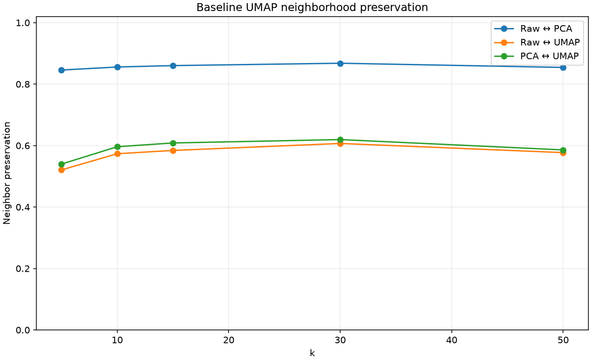
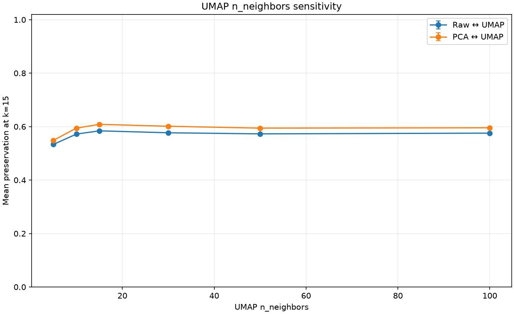
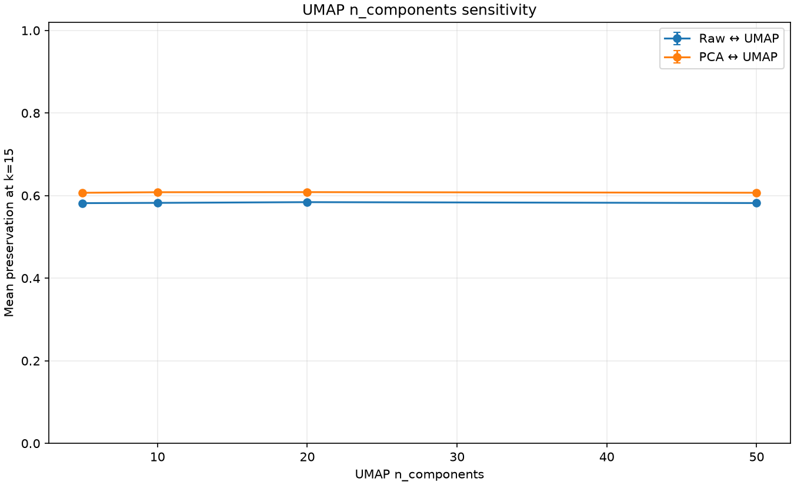
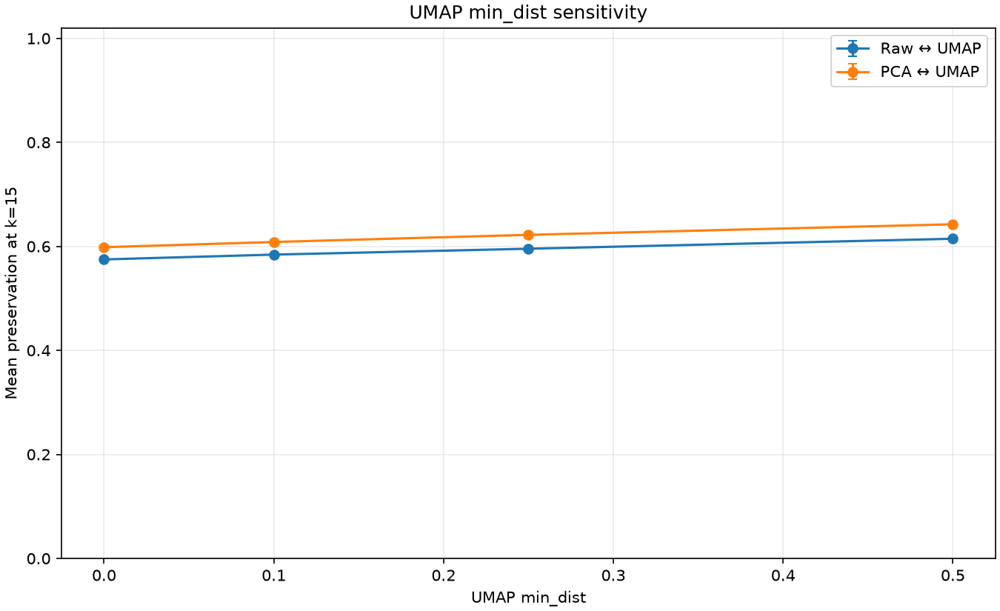
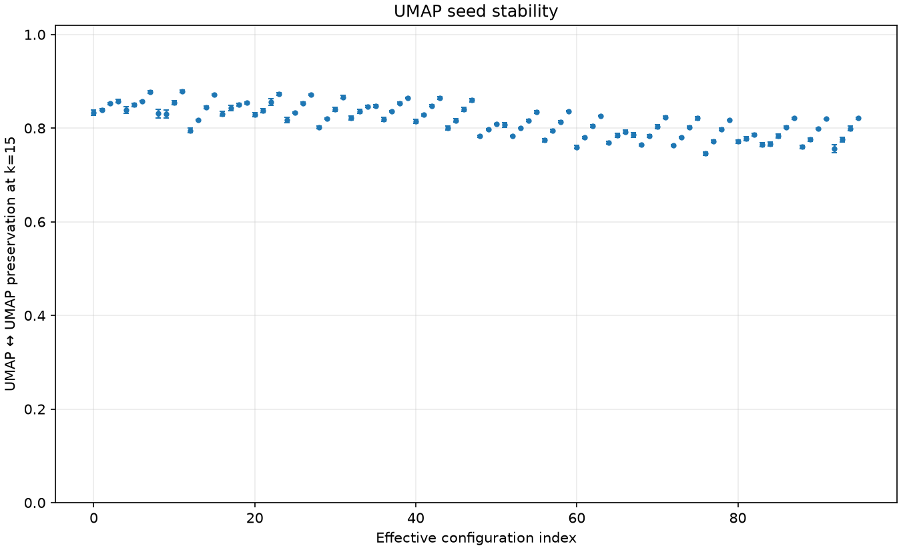

# PCA·UMAP neighborhood-preservation experiment

This report measures exact kNN overlap through the fixed `raw → PCA → UMAP` path. HDBSCAN is intentionally not fitted in this experiment.

## Protocol

- Dataset: 720 rows × 3072 dimensions; input L2-normalized once before the fixed PCA selection.
- Metrics: raw/PCA cosine, UMAP Euclidean, exact non-self kNN; k = 5, 10, 15, 30, 50.
- PCA selection: one fit/selection with seed 42, selected dimension 160 (global_preservation_knee_after_local_plateau).
- UMAP: `init=random`, `n_jobs=1`, seeds = [42, 43, 44, 45, 46].
- Additional loss is `Raw↔PCA - Raw↔UMAP`; it is a diagnostic difference, not a strict decomposition of information loss.

## Production baseline

The current PCA→UMAP→HDBSCAN code omits `min_dist`, so the effective UMAP constructor default is 0.1. The baseline is therefore `n_neighbors=15`, `n_components=20`, `min_dist=0.1`.

**Data note:** this run did not use the original `wikipedia_embeddings/document_embeddings.npy` artifact. It uses the explicitly supplied or repository fallback embedding input; its results must not be presented as the original 720-row Wikipedia BGE benchmark.

| k | Raw↔PCA mean | Raw↔UMAP mean | PCA↔UMAP mean | additional loss | seed std (Raw↔UMAP) |
|---:|---:|---:|---:|---:|---:|
| 5 | 0.8458 | 0.5208 | 0.5398 | 0.3250 | 0.0038 |
| 10 | 0.8557 | 0.5734 | 0.5962 | 0.2823 | 0.0030 |
| 15 | 0.8603 | 0.5842 | 0.6085 | 0.2761 | 0.0029 |
| 30 | 0.8680 | 0.6069 | 0.6195 | 0.2611 | 0.0015 |
| 50 | 0.8543 | 0.5771 | 0.5859 | 0.2773 | 0.0012 |

## Highest Raw↔UMAP configurations

| n_neighbors | n_components | min_dist | mean Raw↔UMAP |
|---:|---:|---:|---:|
| 100 | 20 | 0.5 | 0.6032 |
| 100 | 50 | 0.5 | 0.6031 |
| 100 | 10 | 0.5 | 0.6025 |
| 15 | 20 | 0.5 | 0.6021 |
| 15 | 10 | 0.5 | 0.6010 |

## Interpretation and decision notes

- Fixed PCA baseline: selected 160D; mean Raw↔PCA across k = 0.8568 (k=15: 0.8603).
- Production UMAP baseline at k=15: Raw↔UMAP = 0.5842, PCA↔UMAP = 0.6085, Raw↔UMAP seed std = 0.0029.
- Production baseline seed reproducibility at k=15: UMAP↔UMAP = 0.8286 (std 0.0022).
- Highest mean Raw↔UMAP in the sweep: n_neighbors=100, n_components=20, min_dist=0.5 (mean across k = 0.6032).
- Highest mean PCA↔UMAP in the sweep: n_neighbors=100, n_components=20, min_dist=0.5 (mean across k = 0.6220).
- These are relative geometry results only; HDBSCAN quality and the original Wikipedia BGE benchmark must be evaluated separately before changing production settings.

## Artifacts

- `report.json`: complete raw run and reproducibility records.
- `runs.csv`: one row per effective UMAP configuration and seed.
- `summary.csv`: mean/std aggregation across UMAP seeds.
- `pca-selection.json`: PCA candidates, selection reason, explained variance, and selected Raw↔PCA preservation.
- `baseline-k-preservation.png`, `n-neighbors-sensitivity.png`, `n-components-sensitivity.png`, `min-dist-sensitivity.png`, `seed-stability.png`: requested plots.

